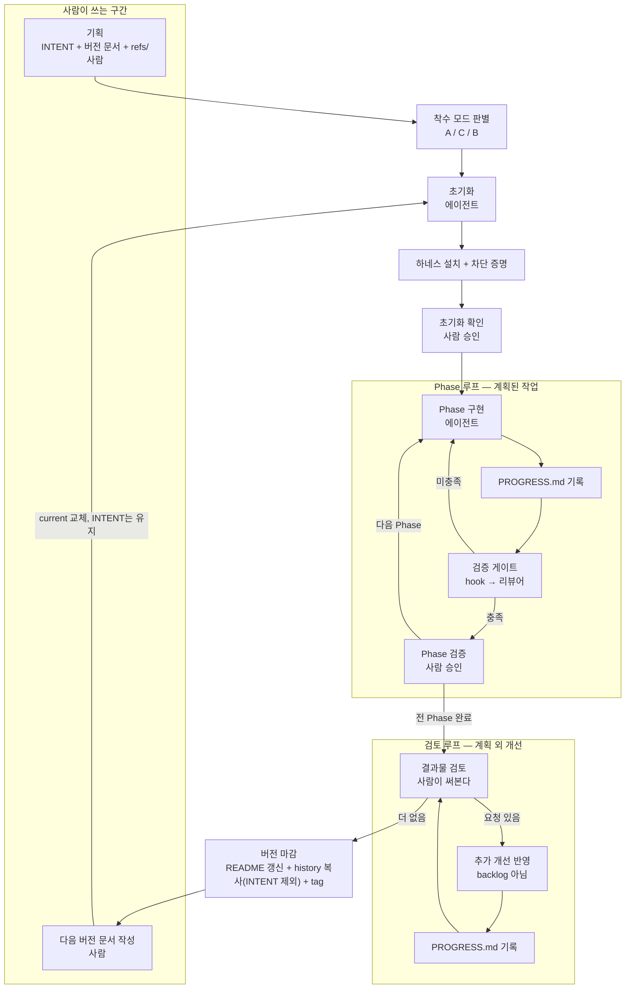

# WORKFLOW — 기획, 프로젝트 시작, 버전 진행

문서를 기획하는 단계, 프로젝트를 시작하는 단계, 새 버전을 진행하는 단계의 절차를
정의한다.

관련 문서
- 문서별 블럭 정의: `docs/DOC-SCHEMA.md`
- 버전 전환과 기록: `docs/VERSIONING.md`
- 에이전트 초기화 절차: `docs/INIT.md`
- 하네스 구성: `docs/HARNESS.md`
- 단계별 프롬프트 예제: `docs/PROMPTS.md`
- 파일 본보기: `docs/templates/`

---

## 1. 전제

**사람이 문서를 먼저 쓴다. 에이전트는 그 문서를 받아 구조를 세우고 구현한다.**

에이전트가 요구를 대신 정하지 않는다. 무엇을 만들지 정하는 것은 사람의 일이고,
그것을 문서로 넘기지 않으면 에이전트는 추측으로 채운다. 다만 **손을 놓으라는 뜻이
아니다** — 에이전트는 무엇을 물어야 사람이 쓸 수 있는지 찾아 질문한다
(`DOC-SCHEMA.md` 1절, "사람이 쓴다"는 무슨 뜻인가).

시작 전에 갖춰져 있어야 하는 것.

| 항목 | 확인 |
| --- | --- |
| backlog CLI | 설치돼 있고 실행된다 (`backlog`를 쓸 때) |
| **가이드 레포** | **로컬에 클론돼 있다** |
| `INTENT.md` | `v0.1`이면 작성돼 있다 (SSOT) |
| 버전 문서 | 이번 버전 것이 작성돼 있다 (`BRIEF`·`DECISIONS`·`PLAN` 필수, `SPEC`·`backlog`는 규모에 따라) |
| `README.md` | 개요가 적혀 있다 (`v0.1`만) |

**없으면 시작하지 않는다.** 그리고 **프로젝트 안으로 복사하지 않는다.** backlog CLI도
가이드 문서도 마찬가지다. 사본이 생기면 원본이 갱신돼도 옛 것이 남고, 프로젝트마다
다른 버전을 따르게 된다.

가이드는 경로로 참조한다.

```
d:/tools/project-workflow/docs/INIT.md 를 읽고 이 프로젝트를 초기화해줘.
```

이 지시 한 줄이면 된다. `INIT.md`가 진입점이고, 나머지 문서는 거기서 상대 경로로
가리킨다. 예제는 `PROMPTS.md`에 있다.

---

## 2. 설계 원칙

**프로젝트명은 폴더와 GitHub에서 하나다**
프로젝트명은 단어를 `-`로 연결한 `project-name` 형식을 사용한다. 프로젝트 폴더명과
GitHub 저장소명은 정확히 같아야 하며, 단어 연결에 `_`를 사용하지 않는다.

**의도와 버전을 가른다**
`INTENT.md`는 버전이 올라가도 변하지 않는 SSOT다. 버전 문서(`BRIEF`·`DECISIONS`·
`SPEC`·`PLAN`·`backlog`·`PROGRESS`)는 버전마다 새로 쓰인다. INTENT는 그 위에서 계속
이어진다 (`DOC-SCHEMA.md` 2절).

**현재와 과거를 폴더로 가른다**
현재 버전은 `docs/current/`, 지난 버전은 `docs/history/vX.Y/`. 마감은 `current/`를
history로 복사하는 것이고, **`INTENT.md`만 빼고** 복사한다 — INTENT는 항상 현재에만
하나 있어야 한다 (`VERSIONING.md` 4절).

**버전마다 문서를 새로 쓴다 — INTENT는 예외다**
버전 문서를 누적하지 않는다. `history/v0.1/`을 열면 그 버전이 무엇이었는지 그 폴더만으로
완결된다. 단 `INTENT.md`는 버전마다 새로 쓰지 않고 하나가 이어진다.

**문서 개수는 고정이 아니다**
요구가 단순하면 `SPEC`을 생략하고 `BRIEF`→`PLAN`으로 갈 수 있고, task 분해가 필요
없으면 `backlog` 없이 `PLAN`만으로 진행할 수 있다 (`DOC-SCHEMA.md` 1절). 있는 문서에
대해서만 검사한다.

**기록은 남기는 것이 아니라 읽히는 것이다**
커밋 이력은 남지만 사람이 읽지 않는다. `PROGRESS.md`는 사람이 열어서 확인하기
위해 있다.

**규칙과 강제 장치는 쌍이다**
문서에 적은 규칙 중 기계가 판정할 수 있는 것은 hook으로 막는다. 판정할 수 없는
것만 사람에게 맡긴다.

**버전 번호는 사람이 정한다**
major·minor 모두 사람이 정한다. 자동 규칙은 없다 (`VERSIONING.md` 1절).

**되돌릴 수 없는 작업은 사람에게 묻는다**
배포, 외부 상태 변경, 파일 삭제는 자동 승인 대상이 아니다.

---

## 3. 기획 단계 — 프로젝트가 서기 전

문서는 프로젝트 폴더가 만들어지기 전에 먼저 쓴다. 이 초안이 어디 있든 상관없다 —
`_ideas/`, `planning/`, 아무 폴더나 된다. **폴더 이름을 강제하지 않는다.**

기획 단계에서 만드는 것.

| 것 | 무엇 |
| --- | --- |
| `INTENT.md` | 이 프로젝트가 무엇을 왜 하는가. SSOT. 가장 먼저 쓴다 (`v0.1`) |
| 버전 문서 초안 | `BRIEF`·`DECISIONS`·`PLAN` 등, 이번 버전 것 |
| `refs/` | 참고 자료를 모으는 하위 폴더 — 스크린샷, 참조 코드 메모, 외부 문서 |

`refs/`는 문서를 쓰는 근거가 되는 재료를 담는다. 결정을 정당화하거나 설계를 잡을 때
본 것들이다. **프로젝트가 시작되면 `refs/`는 `docs/refs/`로 옮겨져 보관된다**
(`INIT.md`). 기획의 근거를 프로젝트 안에 남기기 위해서다.

`INTENT.md`는 기획 때 사람과 함께 가장 먼저 만들고, 프로젝트가 서면
`docs/current/`로 들어가 그 뒤로 계속 거기 상주한다 (`DOC-SCHEMA.md` 2절).

---

## 4. 착수 모드 — 세 가지

`INIT.md`가 상황을 판별해 셋 중 하나로 진행한다.

| 모드 | 언제 | 참조 대상 | 시작 버전 |
| --- | --- | --- | --- |
| **A. 신규** | 새 프로젝트를 처음 시작 | 없음 | `v0.1` |
| **C. 참조 후 신규** | 기존 프로젝트에서 배우되 새로 시작 | 기존 프로젝트 문서·코드 (**읽기만**) | `v0.1` |
| **B. 새 버전** | 같은 프로젝트의 다음 버전 | 자기 `docs/history/` | `v0.2`+ |

**C가 A와 다른 점은 참조뿐이다.** 기존 프로젝트를 이어받는 것이 아니라 새 프로젝트로
시작하되, 그 프로젝트의 문서와 코드를 **참고 자료로만** 본다. 기존 프로젝트를 고치지
않고, 그 `docs/`를 복사해 오지도 않는다. 배운 것은 새 `INTENT`·`BRIEF`·`DECISIONS`에
사람의 손으로 옮겨 담는다. 참고한 위치는 `refs/`에 메모로 남긴다.

C에서 기존 프로젝트를 참조할 때 지킬 것.

- 기존 프로젝트의 파일을 **수정·삭제하지 않는다.** 읽기만 한다.
- 기존 결정을 그대로 베끼지 않는다. 이번 프로젝트의 `INTENT`에 맞는지 사람이 판단한다.
- 무엇을 어디서 참조했는지 `refs/`에 남긴다.

**B가 A·C와 다른 점은 이전 버전 대조다** (6절).

---

## 5. 전체 흐름



`v0.1`(모드 A·C)은 `P0`에서 시작하고, `v0.2` 이후(모드 B)는 `E1`에서 시작한다.

---

## 6. 문서와 수명

| 문서 | 담는 것 | 수명 | history |
| --- | --- | --- | --- |
| `INTENT.md` | **이 프로젝트가 무엇을 왜 하는가. SSOT** | 프로젝트 전체 | **안 감** |
| `README.md` | 밖에 소개 — 개요·설치·사용법 | 프로젝트 전체 | 안 감 |
| `BRIEF.md` | 배경, **이번 버전에서 풀고 싶은 문제** | 버전 | 감 |
| `DECISIONS.md` | 설계 결정과 근거, 배제한 선택지 | 버전 | 감 |
| `SPEC.md` | 요구사항 · 제약 · 미구현 대상 (선택) | 버전 | 감 |
| `PLAN.md` | Phase 배열과 완료 조건 | 버전 | 감 |
| `backlog.json` | task 분해. 작업 SSOT (선택) | 버전 | 감 |
| `PROGRESS.md` | 진행 로그, 결과, **계획 외 개선 기록** | 버전 | 감 |
| `CLAUDE.md` | 지켜야 할 제약. 매 세션 로드 | 프로젝트 전체 | 안 감 |
| `.claude/` | 하네스 — rules · hooks · agents | 프로젝트 전체 | 안 감 |

`INTENT.md`와 버전 문서·`PROGRESS.md`는 `docs/current/`에 있다.
`README.md`·`CLAUDE.md`·`.claude/`는 루트에 있다. **위치가 수명을 말한다.**

`INTENT.md`와 버전 문서는 **사람이 쓴다** (`DOC-SCHEMA.md` 1절). `PROGRESS.md`는
에이전트가 진행하며 쌓는다.

`INTENT.md`는 특별하다 — SSOT이고, 초기화 이후에도 사람의 요청으로 수정할 수 있으며,
history로 복사되지 않고, 버전 번호와 무관하다 (`DOC-SCHEMA.md` 2절).

`README.md`와 `INTENT.md`가 나뉘는 이유는 독자가 다르기 때문이다. INTENT는 이
프로젝트를 만드는 사람의 판단 기준(SSOT)이고, README는 밖에서 처음 보는 사람에게
건네는 소개다. 개요는 INTENT를 밖으로 풀어 쓴 것이며 INTENT와 어긋나면 안 된다.

`PROGRESS.md`에는 성격이 다른 두 가지가 들어간다.

| 구간 | 무엇 | 출처 |
| --- | --- | --- |
| 계획된 작업 | Phase별 task 진행과 결과 | `backlog.json`(없으면 `PLAN`) |
| **계획 외 개선** | 사람이 결과물을 써보고 요청한 것 | 사람의 요청 |

두 번째가 이 파일이 있어야 하는 진짜 이유다. backlog에 없는 작업이므로 여기 적지
않으면 어디에도 남지 않는다.

---

## 7. 시작 절차 — `v0.1` (모드 A·C)

| # | 단계 | 주체 | 종료 조건 |
| --- | --- | --- | --- |
| 1 | `project-name` 형식의 빈 폴더 생성 | 사람 | 단어는 `-`로 연결하고 `_`는 사용하지 않음 |
| 2 | 기획 문서(INTENT + 버전 문서)와 `README.md`, `refs/`를 두고 `INIT.md` 경로로 초기화 지시 | **사람** | 문서 + 지시 한 줄 |
| 3 | backlog CLI 존재 확인 (`backlog`를 쓸 때) | 에이전트 | 없으면 **멈추고 보고** |
| 4 | `docs/` 구조 생성 · INTENT와 버전 문서를 `docs/current/`로 · `refs/`를 `docs/refs/`로 이동 · `git init` · `.gitignore` · 기준 커밋 | 에이전트 | 커밋 1개, 작업 트리 비어 있음 |
| 5 | `backlog validate` (`backlog`가 있을 때) | 에이전트 | 통과 |
| 6 | 하네스 설치 | 에이전트 | `HARNESS.md` 참조 |
| 7 | hook 차단 증명 | 에이전트 | 가짜 입력이 실제로 막힘 |
| 8 | 초기화 결과 보고 | 에이전트 | — |
| 9 | 확인 | **사람** | 승인 |
| 10 | Phase 구현 | 에이전트 | Phase 완료 조건 충족 |
| 11 | `PROGRESS.md` 기록 | 에이전트 | task마다 append |
| 12 | 검증 — hook → 리뷰어 | 에이전트 | 테스트 통과, 리뷰 완료 |
| 13 | Phase 검증 | **사람** | 승인 |
| 14 | 10~13 반복 | | 전 Phase 완료 |
| 15 | 결과물 검토 — 실제로 써본다 | **사람** | — |
| 16 | 추가 개선 요청 | **사람** | — |
| 17 | 개선 반영. **backlog에 넣지 않는다** | 에이전트 | 12번과 같은 검증 게이트 통과 |
| 18 | `PROGRESS.md`에 요청·조치·결과 기록 | 에이전트 | 요청 건마다 |
| 19 | 15~18 반복 | | 사람이 더 없다고 판단 |
| 20 | 버전 마감 | 에이전트 + 사람 | `VERSIONING.md` 참조 |

**모드 C는 2번에서 기존 프로젝트를 참조 자료로만 본다** (4절). 나머지는 A와 같다.

**전 Phase 완료가 버전 마감이 아니다.** Phase를 다 소진해도 사람이 써보고 손볼
곳이 나온다. 그것까지 끝나야 그 버전이다.

**3번이 "멈추고 보고"인 이유** — 없다고 설치하면 프로젝트마다 다른 버전이 생긴다.

**7번이 필요한 이유** — 등록된 것과 동작하는 것은 다르다. 경로 오타나 종료 코드
문제로 조용히 무력화되는 일이 흔하다. 등록만 하고 넘어가면 있으나 마나 한 장치가 된다.

**9번이 필요한 이유** — 에이전트가 요구를 잘못 읽은 채 Phase를 다 돌면 그때는
되돌리기 어렵다. 읽은 내용을 먼저 말하게 하면 어긋남이 초반에 드러난다.

**17번이 "backlog에 넣지 않는다"인 이유** — backlog는 **이번 버전에 계획한 것**의
기록이다. 진행 중에 항목을 늘리면 계획과 실제가 섞이고, "무엇을 하기로 했었나"가
사후에 바뀐다. 계획은 고정하고 벗어난 것은 로그에 남긴다. 그래야 마감 시점에
**계획 대비 무엇이 더 붙었는지**가 보이고, 그게 다음 버전 `BRIEF`의 재료가 된다.

**19번의 종료는 사람이 판단한다.** 기계가 판정할 수 없다. "더 손볼 곳이 없다"는
써본 사람만 안다.

---

## 8. 개선 절차 — `v0.2` 이상 (모드 B)

| # | 단계 | 주체 | 종료 조건 |
| --- | --- | --- | --- |
| 1 | 개선 요구 수집 — 이전 버전을 써보고 나온 것 | **사람** | — |
| 2 | 버전 올림 선언 | **사람** | 버전 번호 확정 |
| 3 | 새 버전 문서 작성 | **사람** | 이전 버전을 참조해 새로 씀 |
| 4 | `docs/current/`를 새 버전 문서로 교체 — **`INTENT.md`는 지우지 않는다** | 에이전트 | 현재 버전 것만 남고 INTENT 유지 |
| 5 | `docs/current/PROGRESS.md` 새로 시작 | 에이전트 | 빈 상태 |
| 6 | **이전 `BRIEF`와 대조 → 무엇이 달라졌는지 요약** | 에이전트 | 요약 제시 |
| 7 | 요약 확인 | **사람** | 승인 |
| 8 | `backlog validate` (`backlog`가 있을 때) | 에이전트 | 통과 |
| 9 | 하네스 점검 | 에이전트 | 바뀐 게 있을 때만 갱신 |
| 10 | 이후 시작 절차 10~20과 동일 | | 검토 루프 포함 |

시작 절차와 앞부분이 같은 모양이다. 둘 다 **사람이 문서를 준비해 넘기면 에이전트가
배치한다.** 다른 점은 4·6·7번이다.

**4번에서 `INTENT.md`를 지우지 않는다.** SSOT는 버전을 넘어 이어진다. 필요하면 사람이
따로 요청해 수정한다 (`DOC-SCHEMA.md` 2절).

**6번이 이 절차의 핵심이다.** 이전 버전 BRIEF는 `docs/history/`에 있고, 에이전트가
그것을 읽어 이번 BRIEF와 대조한다. history는 보관소가 아니라 참조 대상이다.

---

## 9. 폴더 구조

```
<project>/
├── README.md             밖에 소개 — 개요·설치·사용법. 마감마다 갱신
├── CLAUDE.md             지켜야 할 제약. 매 세션 로드
├── .gitignore
├── .claude/
│   ├── rules/
│   ├── hooks/
│   ├── agents/
│   └── settings.json
├── docs/
│   ├── current/          ← 현재 버전
│   │   ├── INTENT.md         SSOT. history로 안 감. 버전 넘어 상주
│   │   ├── BRIEF.md
│   │   ├── DECISIONS.md
│   │   ├── SPEC.md           선택
│   │   ├── PLAN.md
│   │   ├── backlog.json      선택
│   │   └── PROGRESS.md
│   ├── refs/             기획 때 본 참고 자료 (스크린샷·참조 메모)
│   └── history/
│       ├── v0.1/         버전 문서. INTENT는 없다. 불변
│       └── v0.2/
├── src/
├── scripts/
└── tests/
```

**두 층이다.** 루트는 프로젝트 전체에 걸리는 것, `docs/current/`는 이번 버전 것.
`INTENT.md`는 `current/`에 있지만 수명은 프로젝트 전체다 — 위치가 아니라
`DOC-SCHEMA.md` 2절이 그 예외를 정한다.

`docs/refs/`는 기획 단계의 `refs/`가 옮겨 온 것이다. 근거 자료를 프로젝트 안에 남긴다.

`src/`, `scripts/`, `tests/`는 **첫 필요 시점에 만든다.** 초기화 때
빈 폴더를 미리 파두지 않는다. 구조가 계획이 아니라 관성으로 결정되는 것을 막는다.

---

## 10. 버전 번호

두 단계다. `v<major>.<minor>` — 세 번째 자리는 쓰지 않는다.

| | 뜻 | 누가 |
| --- | --- | --- |
| **minor** | 이번 작업 묶음이 끝났다 | **사람** |
| **major** | 프로그램이 한 단계 완성됐다 | **사람** |

- `v0.x` — 만들어 가는 중. **MVP가 `v0.1`**
- `v1.0` — 목적한 것이 동작하고 실제로 쓰기 시작

**major·minor 모두 사람이 정한다. 자동 규칙은 없다** (`VERSIONING.md` 1절). 에이전트는
버전 번호를 스스로 올리지 않는다. `INTENT.md`가 바뀌는 것과 버전 번호는 무관하다.

**마감한 버전은 고치지 않는다.** 세 번째 자리가 없으므로 수정은 다음 minor로 넘긴다.
`docs/history/` 아래 이미 만들어진 폴더는 수정도 삭제도 하지 않는다.

---

## 11. 배치의 근거

**왜 INTENT를 가장 먼저, 그리고 계속 두나**
프로젝트가 무엇을 왜 하는지는 시작 전에 정해져 있고, 버전이 올라가도 변하지 않는다.
이 SSOT가 없으면 기능이 불어날 때 "원래 하려던 것에 맞나"를 판정할 기준이 없다.
그래서 기획 때 가장 먼저 쓰고, `docs/current/`에 계속 둔다. 버전마다 새로 쓰지 않는다.

**왜 INTENT를 history로 안 보내나**
SSOT는 "지금 유효한 하나"만 의미가 있다. history에 복사하면 버전마다 여러 벌이 쌓여
어느 것이 진짜인지 흐려진다. 과거 상태가 필요하면 `git`으로 본다.

**왜 README와 INTENT를 나누나**
독자가 다르다. INTENT는 만드는 사람의 판단 기준이고, README는 밖에서 처음 보는
사람에게 건네는 소개다. 하나로 합치면 소개 문구와 판단 기준이 섞여, 버전이 올라갈수록
어느 쪽도 제 역할을 못 한다. **사용법은 마감 때 쓴다.** 착수 시점에 쓴 사용법은
반드시 실제와 어긋난다.

**왜 버전 문서를 누적하지 않나**
누적하면 "지금 유효한 요구"와 "지나간 요구"가 한 파일에 섞인다. 상태 컬럼으로
구분하려면 읽는 쪽이 매번 걸러내야 하고, 에이전트에게는 컨텍스트 비용이 된다.

**왜 마감 시점에 history로 복사하나**
마감 순간은 검증이 끝나고 사람이 승인한 상태다. 기록으로 고정하기 가장 정확한 때다.
새 버전 착수까지 미루면 그사이 루트 문서가 손대어질 수 있고, 그러면 history에 남는
것이 마감 시점의 상태가 아니다.

**왜 옮기지 않고 복사하나**
마감했다고 그 버전이 과거가 되는 것이 아니다. 새 버전을 시작하기 전까지 **현재 유효한
버전은 여전히 그것**이고, 루트·`current`에 문서가 있는 것이 맞다. 그리고 복사는 원본을
건드리지 않아 실패해도 기록이 사라지지 않는다.

**왜 `PROGRESS.md`가 따로 있나**
버전 문서는 사람이 쓰고 진행 로그는 에이전트가 쌓는다. 작성 주체와 시점이 다르다.
섞으면 사람이 쓴 것과 에이전트가 쓴 것을 구별할 수 없다.

**왜 버전 무관 결정을 `CLAUDE.md`·`.claude/rules/`로 올리나**
버전 문서는 버전마다 새로 쓰이므로, 계속 유효한 제약을 `DECISIONS.md`에 두면 매 버전
옮겨 적어야 한다. 옮기다 빠뜨리면 조용히 사라진다. `CLAUDE.md`는 매 세션 자동
로드되고 `rules`는 해당 경로 작업에 적용된다. **규칙은 강제되는 자리에 둔다.**

| 성격 | 어디로 |
| --- | --- |
| 앞으로 지켜야 할 **제약** | `CLAUDE.md` · `.claude/rules/` |
| 왜 그렇게 정했나 하는 **근거** | 그 버전 `DECISIONS.md`에 남아 history로 |

---

## 12. 실패 패턴

| 패턴 | 증상 | 교정 |
| --- | --- | --- |
| 에이전트가 스스로 판단해 문서를 씀 | 요구가 일반론이 되고 판단 기준이 안 됨 | 요청·결정은 사람이, 에이전트는 요청받아 질문하고 초안만 |
| "사람이 쓴다"를 손 놓으라는 뜻으로 읽음 | 에이전트가 멈춰 서고 사람이 막힘 | 무엇을 물어야 사람이 쓸 수 있는지 찾아 질문 |
| 하위 문서가 `INTENT`에 어긋남 | SSOT가 흔들려 방향이 갈라짐 | 어긋남을 보고, 사람이 INTENT를 고칠지 하위를 고칠지 판단 |
| `INTENT`를 history로 복사 | SSOT가 여러 벌이 됨 | 마감·중단 복사에서 INTENT 제외 |
| 에이전트가 버전 번호를 스스로 올림 | 완성도 판단을 기계가 함 | major·minor는 사람이 정함 |
| 완료 조건 없는 Phase·task | 에이전트가 자기 판단으로 종료 선언 | `PLAN`·`backlog` 종료 조건 강제 |
| 프로젝트 안에서 backlog CLI 설치 | 프로젝트마다 다른 스키마 | 없으면 멈춤 |
| 가이드 문서를 프로젝트로 복사 | 원본이 갱신돼도 옛 사본을 따름 | 경로로 참조 |
| 참조 프로젝트(모드 C)를 고침 | 남의 프로젝트가 바뀜 | 읽기만. 배운 것은 새 문서에 사람 손으로 |
| 계속 유효한 제약을 `DECISIONS.md`에만 둠 | 다음 버전에서 사라짐 | `CLAUDE.md`·`rules`로 승격 |
| hook 등록 후 미검증 | 강제 장치가 무력화된 채 진행 | 차단 증명 |
| `PROGRESS.md` 미기록 | 진행이 커밋에만 남고 읽히지 않음 | task마다 append |
| 추가 요청을 backlog에 넣음 | 계획과 실제가 섞여 "무엇을 하기로 했었나"가 사라짐 | `PROGRESS.md`에 기록 |
| 전 Phase 완료를 버전 마감으로 봄 | 검토에서 나온 개선이 기록 없이 다음 버전으로 밀림 | 검토 루프까지가 그 버전 |
| history 폴더 수정 | 기록이 사후에 바뀜 | hook으로 차단 |
| 빈 폴더 선행 생성 | 안 쓰는 폴더가 남고 구조가 굳음 | 첫 필요 시점에 생성 |

---

## 13. 버전 이력

| 버전 | 변경 |
| --- | --- |
| 1.0 | 최초 작성. `WORKFLOW-v1.0-ref.md`로 보존 |
| 2.0 | 버전별 5종 스냅샷 구조로 재작성. README·BRIEF 역할 분리, history 저장 시점 확정 |
| 3.0 | `INTENT.md`(SSOT) 신설, README를 외부 소개 문서로 재정의. 기획 단계·`refs/`·세 착수 모드(신규·참조 후 신규·새 버전) 추가. 문서 개수 비고정. 버전 번호는 사람이 정함(자동 규칙 제거). history 복사에서 INTENT 제외 |
